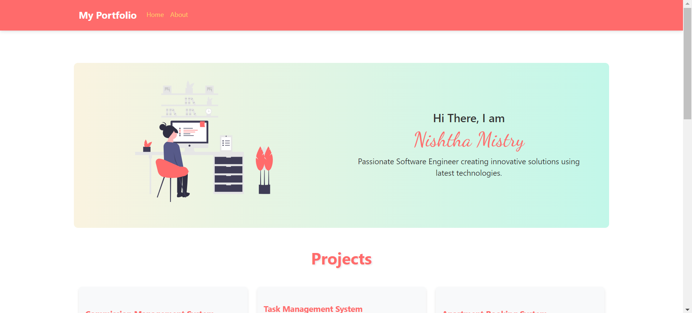

# My Portfolio

This project is a personal portfolio website built using Angular. It showcases my projects and provides a contact form for visitors to reach out to me.

## Table of Contents
- [Introduction](#introduction)
- [Features](#features)
- [Technologies Used](#technologies-used)
- [Setup](#setup)
- [Usage](#usage)
- [Screenshots](#screenshots)

## Introduction

This portfolio website includes the following sections:
- **Introduction**: An introduction to who I am and what I do.
- **Projects**: A showcase of various projects I've worked on.
- **Contact**: A form where visitors can send me messages.

## Features



- Responsive design
- Interactive project cards with flip animations
- Contact form integrated with EmailJS to send emails directly

## Technologies Used

- Angular
- Bootstrap
- EmailJS
- SweetAlert2

## Setup

### Prerequisites

Make sure you have the following installed:
- Node.js
- Angular CLI

### Installation

1. Clone the repository:
    ```bash
    git clone https://github.com/your-username/my-portfolio.git
    cd my-portfolio
    ```

2. Install the dependencies:
    ```bash
    npm install
    ```

3. Set up EmailJS:
    - Sign up at [EmailJS](https://www.emailjs.com/).
    - Create a new email service and email template.
    - Note your `serviceID`, `templateID`, and `userID`.

4. Update the `EmailService` in `src/app/email.service.ts` with your EmailJS credentials:
    ```typescript
    private serviceID = 'your_service_id';
    private templateID = 'your_template_id';
    private userID = 'your_user_id';
    ```

### Running the Application

To start the application, run:
```bash
ng serve


